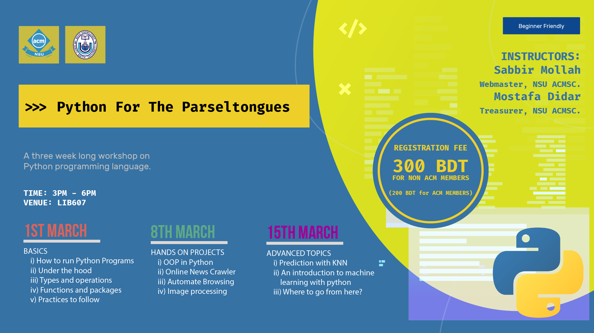

# Python For The Parseltongues - Workshop

> A three week long workshop

This repository will contain the contents for the 3 weeks long workshop on Python programming language organized by NSU ACM SC. 

[]

## Instructors

> [Sabbir Mollah](https://github.com/SabbirMollah)

> [Mostafa Didar](https://github.com/mossydidar)

## License

- **[MIT license](http://opensource.org/licenses/mit-license.php)**
